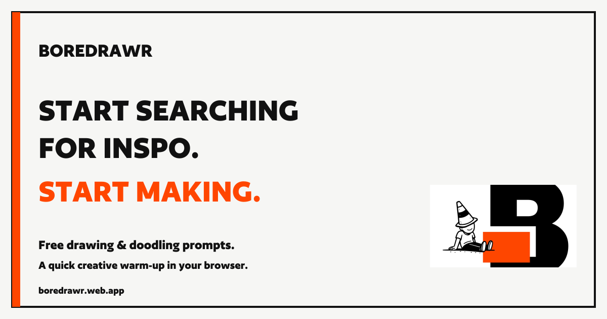
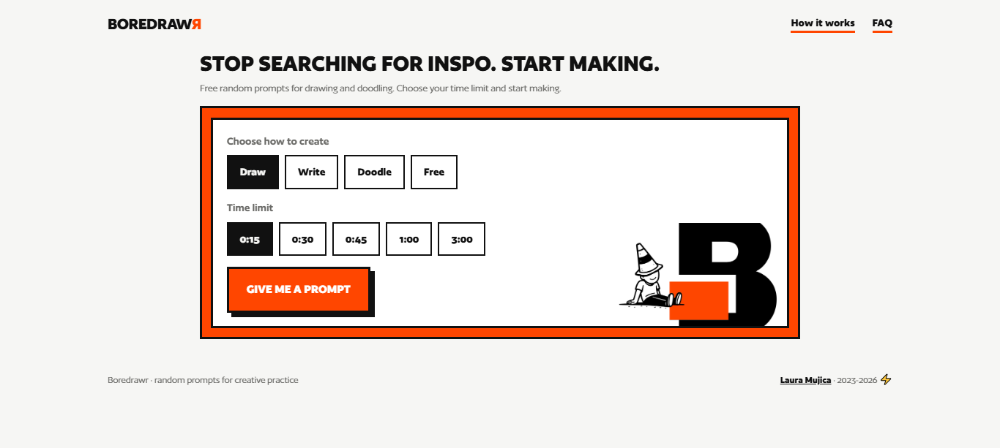

# Boredrawr

**From a visual identity to a working web app: design, scripting and AI-assisted development.**

Boredrawr is a free drawing and doodle prompt generator for short creative exercises. Choose a mode, set a timer and make something from an unexpected prompt. Writing and free-form modes offer other ways to respond.

**[Open the web app](https://boredrawr.web.app/)** · **[Explore the naming and visual identity on Behance](https://www.behance.net/gallery/223417035/Boredrawr-Naming-Visual-Identity)** · **[My portfolio](https://lauramujica.com/)**

## Why I made it

Searching for inspiration can become another way to postpone creating. Boredrawr gives people a small starting point: one prompt, a short time limit and room to interpret it in their own way.

**Stop searching for inspo. Start making.**

## My role

I developed the concept, naming and visual identity manually, and directed the project through presentation, web implementation, publication and iteration. I made the visual and product decisions, reviewed the AI-assisted outputs and used feedback to refine the result.

This project brings together my design practice and my interest in improving creative workflows through scripting, automation and AI.

## How the project came together

| Stage | My approach | Output |
| --- | --- | --- |
| Concept and identity | I developed the naming, visual language and brand assets through my established design process. | A visual identity to guide the project. |
| Presentation automation | I created a script to generate the presentation boards for the Behance project. | A way to assemble the visual presentation with less repetitive layout work. |
| First web implementation | I used that presentation as the visual reference for Claude, then reviewed and approved the resulting website. | A working, branded web app. |
| Repository and publication | I used ChatGPT to help configure GitHub and Firebase Hosting, including automatic publication from the repository. | A live site at `boredrawr.web.app` and a repeatable deployment process. |
| Iteration and maintenance | I used ChatGPT to help separate the code and assets, organize the prompts as JSON, and refine copy, layout and the FAQ through GitHub changes. | A clearer project structure and an evolving product. |
| Search and measurement | I added Google Analytics, registered the site in Google Search Console, and worked on page metadata, a sitemap and social sharing previews. | The foundation for measuring use and monitoring search visibility. |

### How I used AI

Claude helped translate an existing visual direction into the first web implementation. ChatGPT helped with code organization, repository and hosting setup, troubleshooting and subsequent improvements. I supplied the direction, evaluated the results and decided which changes to keep.

The app generates prompts by combining words and templates from a local JSON file. It does not call an AI model during use.

## What works today

- Four creative modes: Draw, Doodle, Write and Free.
- Time limits of 15, 30 or 45 seconds, 1 minute or 3 minutes.
- 896 possible prompt combinations across the four modes.
- A completion count stored locally in the user's browser.
- Responsive layout, an explanation of the experience and a separate FAQ.
- Automatic Firebase Hosting deployments through GitHub Actions.

The current version is available in English and Spanish. [Open the Spanish version](https://boredrawr.web.app/es/). It does not store drawings or writing.

## Next steps

- Refine visual legibility.
- Expand and curate the prompt vocabulary.
- Gather user feedback to guide further improvements.

---

**Laura Mujica · 2026 ⚡**  
[lauramujica.com](https://lauramujica.com/)
